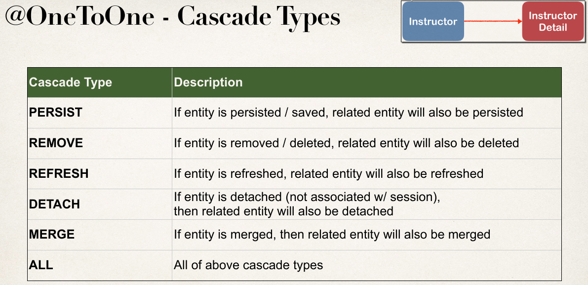
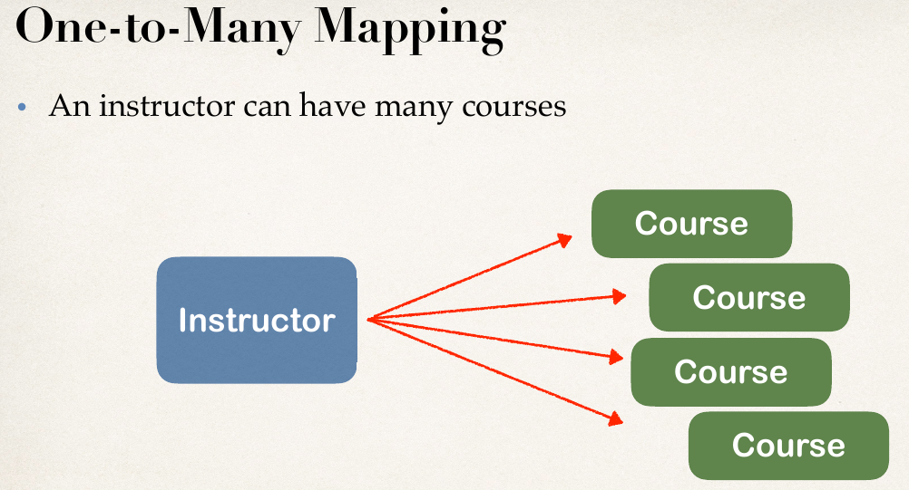

### Hibernate Architecture

* <b>SessionFactory</b> - Это фабрика для сессий и клиент ConnectionProvider. Содрежит опциональный L2 кеш сущностей. Конфигурируется xml-файлом:
```java
SessionFactory factory = new Configuration()
                .configure("hibernate.cfg.xml")
                .addAnnotatedClass(Student.class)
                .buildSessionFactory();
```
* <b>session</b> object provides an interface between the application and data stored in the database. It is a short-lived object and wraps the JDBC connection. It is factory of Transaction, Query and Criteria. It holds a first-level cache (mandatory) of data. The org.hibernate.Session interface provides methods to insert, update and delete the object. It also provides factory methods for Transaction, Query and Criteria.
* <b>Transaction</b>
The transaction object specifies the atomic unit of work. It is optional. The org.hibernate.Transaction interface provides methods for transaction management.
* <b>ConnectionProvider</b>
It is a factory of JDBC connections. It abstracts the application from DriverManager or DataSource. It is optional.
* <b>TransactionFactory</b> It is a factory of Transaction. It is optional.
* Конфигурационный файл hibernate указывает параметры соединения с БД.


### Session
* <b>Persistence context</b> - это кеш, хранящий все управляемые объекты. Привязан к сессии. При чтении объектов в начале опрашивается кеш и только потом БД, это гарантирует repeatable read. При коммите транзакции в БД обновляются только измененные объекты (automatic dirty checking).
* <b>Session</b> == EntityManager.
    1. Сессия представляет собой транзакцию в бд.
    2. Сессия = connection+persistence context.
    3. SessionFactory.getCurrentSession() - возвращает (создает, если не создана) сессию, привязанную к определенному контексту (например потоку), закрывать ее не нужно. Контекст указывается в конфигур. файле hibernate - current_session_context_class
    4. SessionFactory.openSession() - всегда открывает новую сессию, которую необходимо закрывать.
* Пример работы с сессией:
```java
Session session = factory.openSession();
Transaction tx = null;

try {
   tx = session.beginTransaction();
   // do some work
   ...
   tx.commit();
}

catch (Exception e) {
   if (tx!=null) tx.rollback();
   e.printStackTrace();
} finally {
   session.close();
}
```    
* Сущность может пребывать в состояниях:
    1. <b>transient object</b> Объект не присоединенен и никогда не был присоединен к сессии. Это вновь создаваемые объекты.
    2. <b>persistent object</b> Объект присоединенный к конкретной сессии. При работе с объектом данного типа в рамках транзакции все изменения объекта записываются в базу по окончании транзакции. В этом статусе объект имеет(или будет иметь по окончанию транзакции) первичный ключ.
    3. <b>removed</b> Объект, удаление которого запланировано на окончание транзакции. До окончания транзакции объет присоединен к сессии.
    4. <b>detached object</b> Объект отсоединённый от сессии.

  
  
  
  


* <b>persist</b>
  ```java
  Person person = new Person();
  person.setName("John");
  session.persist(person);
  ```
  1. Поcле вызова persist объект person изменяет состояние: transient->persistent.
  2. Объект еще не сохранен в БД.Все изменения, вносимые в объект будут сохранены при коммите транзакции или session.flush(),session.close()
  3. Операция persist применяется ко всем связанным объектам, если указано cascade=PERSIST|ALL
  4. Повторный вызов persist ничего не делает с передаваемой сущностью, но влияет на связанные сущности по пункту 3.
  5. persist(detached entity)->exception

* <b>save</b>(hibernate specific)
  ```java
  Person person = new Person();
  person.setName("John");
  Long id = (Long) session.save(person);
  ```
  1. Гибернат-специфичный метод, сразу сохраняет сущность и возвращает первичный ключ.
  2. save(detached entity)->создаст новую сущность в бд.
  ```java
  Person person = new Person();
  person.setName("John");
  Long id1 = (Long) session.save(person);
  //отсоединить объект от сессии
  session.evict(person);
  Long id2 = (Long) session.save(person);
  //получим дубликат
  ```
* <b>merge</b> обновляет или создает persistent entity на основе detached или transient объекта:
  1. Получает объект по id из кеша или из базы. Или создает новый.
  2. Копирует остальные поля из передаваемого объекта во вновь созданный.
  3. возвращает persistent объект.
  4. Операция повторяется для всех связанных сущностей с cascade=MERGE|ALL.
  5. Если сущность в состоянии persistent, то метод ничего с ней не делает, связанные сущности обрабатываются аналогично 4.
```java
Person person = new Person();
person.setName("John");
session.save(person);
//remove person from persistence context
session.evict(person);
person.setName("Mary");

Person mergedPerson = (Person) session.merge(person);
```
* <b>update</b>(hibernate specific)
  1. Переводит объект из detached в persistent
  2. Выбрасывает исключение при передаче transient сущности.
  3. Обновляет информацию в базе.
```java
Person person = new Person();
person.setName("John");
session.save(person);
//удалим person из persistence context
session.evict(person);

person.setName("Mary");
session.update(person);
```
* <b>saveOrUpdate</b>(hibernate specific)
  1. transient:сохраняет и переводит в состояние persistent
  2. detached:обновляет и переводит в состояние persistent

* <b>\<T> T get(Class\<T> entityType,Serializable id)</b>(hibernate) Получить объект по его id, возвращает null, если объект не найден.
* <b>\<T> T find(Class\<T> entityClass,
           Object primaryKey)</b> аналогично get.
```java
Student foundStudent = session.get(Student.class,1L);
```
* <b>Query createQuery(String queryString)</b> Создать запрос, используя HQL/JPQL.
```java
//select
Query query = session.createQuery("FROM Student s WHERE s.lastName = :lastName");
query.setParameter("lastName", "Doe");
List<Student> studentList = query.getResultList();
//update
session.createQuery("UPDATE Student SET email = 'foo@gmail.com'").executeUpdate();
//delete
session.createQuery("DELETE FROM Student s WHERE s.id = 5").executeUpdate();
```
* <b>void delete(Object o)</b>(hibernate) - удалить объект из БД.
  1. Сущность либо persistent
  2. Либо transient, но с первичным ключем
  3. Операция каскадируется на связанные сущности если указано cascade="delete"
  4. Удаление происходит при коммите транзакции.
* <b>void remove(Object o)</b>(jpa) - удалить объект из бд. Сущность не должна быть detached.
```java
Student student4 = session.get(Student.class, 4);
session.delete(student4);
```
### ORM Mapping
* id generators. Для создания кастомного генератора нужно унаследоваться от <b>SequenceGenerator</b> и переопределить метод <b>public Serializable generate(...)</b>


* Entity example:
```java
@Entity
@Table(name = "student")
@NoArgsConstructor
@Getter
@Setter
@ToString
public class Student {
    @Id
    @Column(name = "id")
    @GeneratedValue(strategy = GenerationType.IDENTITY)
    private int id;
    @Column(name = "first_name")
    private String firstName;
    @Column(name = "last_name")
    private String lastName;
    @Column(name = "email")
    private String email;
}
```
* <b>@Temporal</b>
  1. Можно использовать для типов util.Date,Calendar
  2. TemporalType.DATE - сохранит только дату, TIME только время и TIMESTAMP дату и время.
  3. Столбец в бд может иметь тип date,time,timestamp.
```java
@Column(name = "date_of_birth")
@Temporal(TemporalType.TIMESTAMP)
private Date dateOfBirth;
```
### Table Relations
* <b>Cascading</b> это применение той же операции к связанным сущностям.



* <b>Fetch Types</b>
  1. Eager - при получении сущности, получить и зависимые сущности.
  2. Lazy - при получении сущности зависимые сущности получаем по запросу.
* <b> Relationship directions</b>


* <b>Mapping Types</b>
  1. <b>One-to-One</b> Чтобы сделать отношение двунаправленным, надо добавить в InstructorDetail:
```java
@OnetToOne(mappedBy="insctructorDetail")
private Instructor instructor;
```




