# SpringBoot
* см. SpringAndHibernate/spring-boot/*


* Используя <span style="color:blue;">SpringBoot</span> можно запускать приложение, используя втроенный <span style="color:blue;">http-server</span> или деплоить приложение на <span style="color:blue;">standalone server</span>.
* Поддержка SpringBoot включена в различные IDE ( в т.ч. в Netbeans).


* mycoolapp: Сгенерируем проект со встроенным tomcat-сервером и поддержкой spring mvc (см. SpringAndHibernate/spring-boot/mycoolapp/)
  1. goto start.spring.io
  2. GAV com.luv2code.springboot.demo,mycoolapp
  3. Сборщик: maven
  4. dependencies: web
* приложение деплоится на запускаемый сервер по корневому пути.
* запуск осуществляется простой командой:
```bash
java -jar mycoolapp.jar
```
* Добавим в приложение <b>@RestController</b> возвращающий строку по корневому пути(FunRestController).

## SpringBoot Project Structure
##### Структура каталогов:


* Если maven проинсталлирован локально, то mwnw файлы можно удалить.

##### pom.xml содержит:
  1. Ссылку на ParentPom.
  2. Указанные GAV-координаты проекта.
  3. Выбранные зависимости, которые содержат транзитивные зависимости с правильными версиями (т.н.spring boot starters):
  ```xml
  <dependencies>
		<dependency>
			<groupId>org.springframework.boot</groupId>
			<artifactId>spring-boot-starter-web</artifactId>
		</dependency>

		<dependency>
			<groupId>org.springframework.boot</groupId>
			<artifactId>spring-boot-starter-test</artifactId>
			<scope>test</scope>
		</dependency>
  </dependencies>
  ```

  4. <b>spring-boot-maven-plugin</b> содержащий разные задачи, например:
  ```bash
  mvn spring-boot:run
  ```

##### Исходный код:
  1. Приложение запускается при помощи <b>  SpringApplication.run(...)</b>
  этот класс создает ApplicationContext, запускает встроенный сервер Tomcat и совершает прочие действия, необходимые для запуска приложения.

  2. <b>MycoolappApplication</b> это собственно точка входа в приложение и одновременно класс конфигурации, аннотированный через <b>@SpringBootApplication</b>


  * <b>Application-класс</b> следует располагать в корневом пакете, чтобы все бины из подпакетов могли быть зарегистрированы.


  * Можно добавить нужные для сканирования пакеты и вручную:


  3. <b>application.properties</b> - файл свойств, автоматически загружамый SpringBoot. Может содержать предопределенные и произвольные свойства:
  ```propertes
  #pre-defined property
  server.port=8585
  #custom property
  coach.name=My Coach
  ```
  * Свойства из файла свойств инжектируются как обычно через <b>@Value("${prop.name}")</b>:


  4. <b>Статические ресурсы</b> - html,css etc. располагаются в директории <b>src/main/resources/static</b>.

  
  

  5. <b>Шаблоны</b>

  

  6. <b>Unit tests</b>

  

##### Spring boot starters
* Содержат наборы зависимостей с правильными версиями.


* Spring initializr автоматически добавит в проект выбранные spring-boot-starters.
* <b>Spring-boot-starter-parent</b>:
    1. Хранит настройки по умолчанию (кодировка,версия java,...) - можно переопределить в элементе <b>\<properties\></b>;
    2. Хранит версии <b>spring-boot-starter-* </b>
    3. Содержит конфигурацию <b>spring-boot-maven-plugin</b>


##### Spring boot dev tools


* В IDEA нужно построить проект заново(mvn package), чтобы изменения кода привели к рестарту контейнера.

##### Spring boot actuator
* Spring boot actuator позволяет проверять статус запушенного приложения,управлять им и собирать статистику.


```xml
<!-- add support for management,info etc -->
<dependency>
			<groupId>org.springframework.boot</groupId>
			<artifactId>spring-boot-starter-actuator</artifactId>
</dependency>
```
##### Running spring boot from CMD

* Запускать spring-boot приложения можно 2-мя способами:
```bash
#method 1
mvn[w] package
cd target
java -jar jarname.jar
#method2
mvn[w] package
mvn[w] spring-boot:run
```
##### Configuring spring boot server
* Spring boot конфигурируется (помимо прочего) через свойства в application.properties.

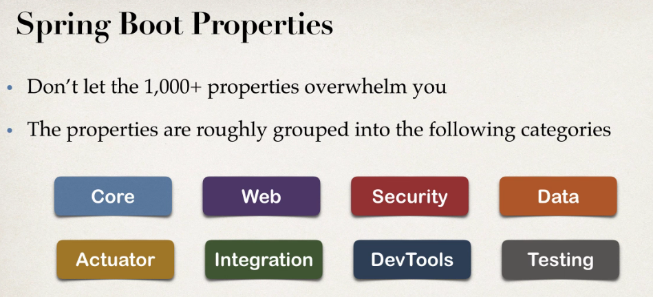
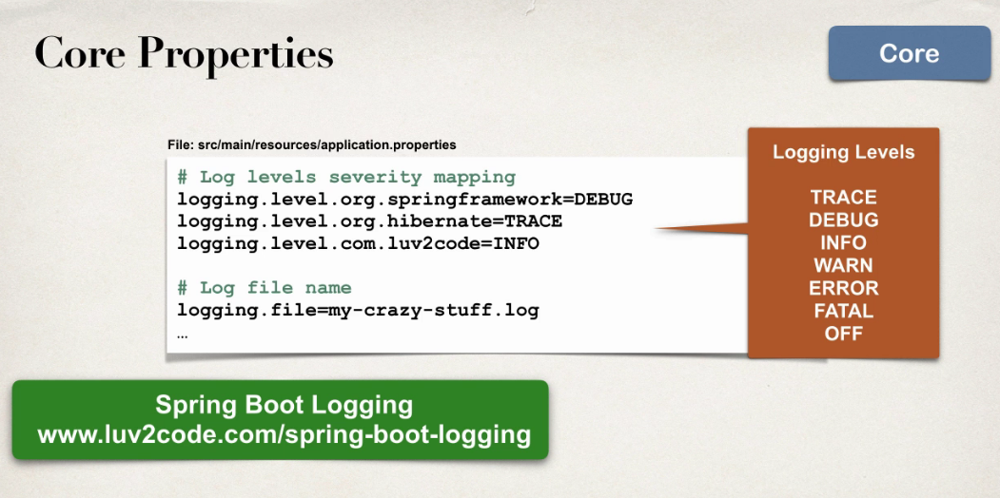


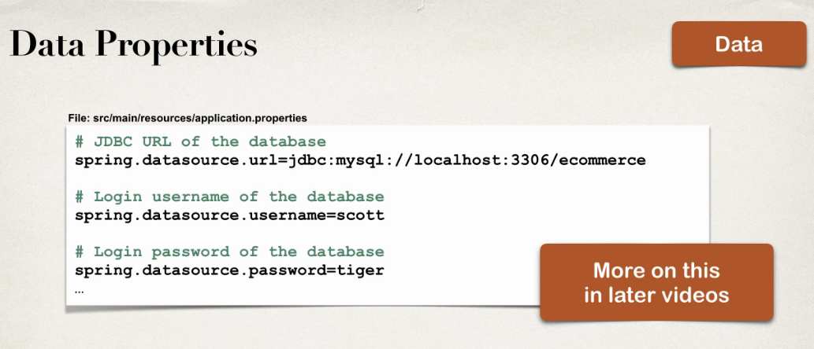
##### Adding ORM+rest api


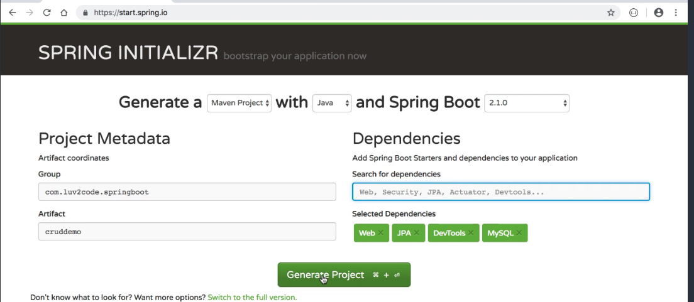
* Нужно сконфигурировать datasource в application.properties (можно определить размер пула и прочие свойства):
```properties
# ===============================
# = DATA SOURCE / HicariCP
# ===============================
# Set here configurations for the database connection
spring.datasource.url= jdbc:postgresql://localhost:5432/hb_student_tracker
spring.datasource.username=postgres
spring.datasource.password=postgres
#hikariCP
spring.datasource.hikari.maximumPoolSize=10
# ===============================
# = JPA / HIBERNATE
# ===============================
# Show or not log for each sql query
spring.jpa.show-sql=true
# Hibernate ddl auto (create, create-drop, update): with "create-drop" the database
# schema will be automatically created afresh for every start of application
spring.jpa.hibernate.ddl-auto=none

# Allows Hibernate to generate SQL optimized for a particular DBMS
spring.jpa.properties.hibernate.dialect=org.hibernate.dialect.PostgreSQLDialect

#sprinng naming conventions by default will:
#spring.jpa.hibernate.naming.physical-strategy=org.springframework.boot.orm.jpa.hibernate.SpringPhysicalNamingStrategy
#spring.jpa.hibernate.naming.implicit-strategy=org.springframework.boot.orm.jpa.hibernate.SpringImplicitNamingStrategy
#Replace dots with underscores
#Change camel case to snake case, and
#Lower-case table names   
```
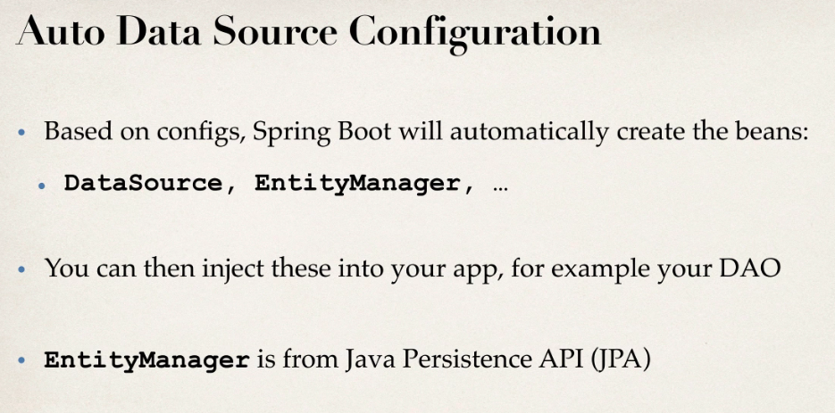
* Hibernate является JPA-провайдером по умолчанию.
* Auto-choosing connection pool:
  1. We prefer HikariCP for its performance and concurrency. If HikariCP is available, we always choose it.
  2. Otherwise, if the Tomcat pooling DataSource is available, we use it.
  3. If neither HikariCP nor the Tomcat pooling datasource are available and if Commons DBCP2 is available, we use it.
##### Using JPA
  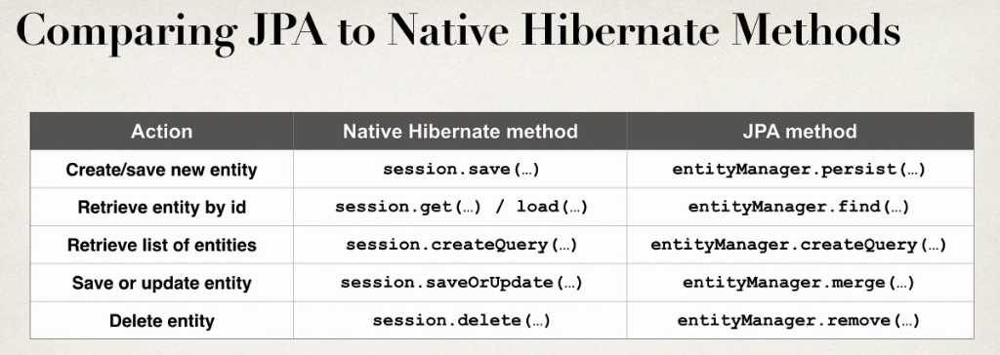
##### Sping Data JPA
* Большинство кода в DAO повторяется, обычно отличается только сущность и первичный ключ. Spring Data Jpa автоматически реализует CRUD-методы.

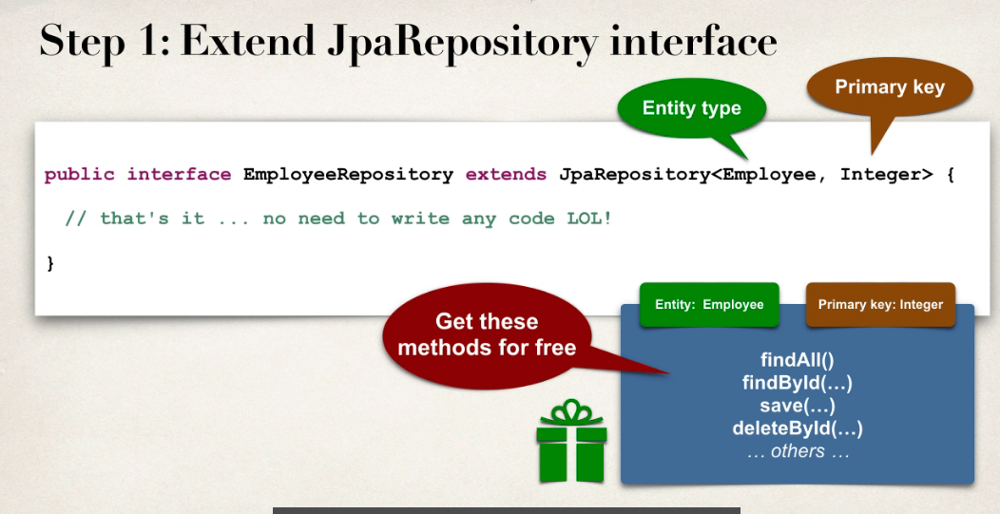
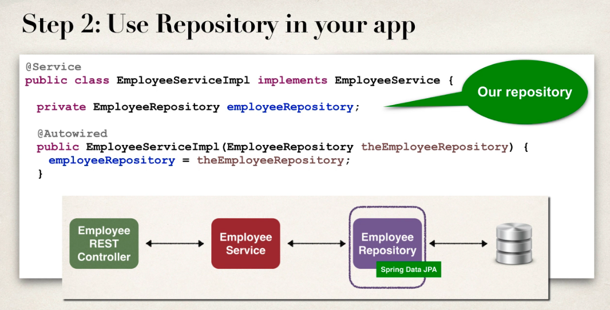
* JpaRepository уже содержит @Transactional, можно убрать эту аннотацию из сервиса.
* Чтобы jackson2 нормально работал с прокси-сущносятми, возвращаемыми Hibernate нужно добавить зависимость:
```xml
<dependency>
			<groupId>com.fasterxml.jackson.datatype</groupId>
			<artifactId>jackson-datatype-hibernate5</artifactId>
			<version>2.9.8</version>
</dependency>
```
* <b>Jackson2ObjectMapperBuilder</b> используется для конфигурации ObjectMapper:
  1. If Jackson is on the classpath, you already get the default converter(s) provided by Jackson2ObjectMapperBuilder, an instance of which is auto-configured for you.
  2. Any beans of type <b>com.fasterxml.jackson.databind.Module</b> are automatically registered with the auto-configured <b>Jackson2ObjectMapperBuilder</b> and are applied to any <b>ObjectMapper</b> instances that it creates. This provides a global mechanism for contributing custom modules when you add new features to your application.
  3. <b>Jackson2ObjectMapperBuilder</b> can be customized by one or more <b>Jackson2ObjectMapperBuilderCustomizer</b> beans:
  ```java
  @Bean
    public Jackson2ObjectMapperBuilderCustomizer addCustomBigDecimalDeserialization() {
        return new Jackson2ObjectMapperBuilderCustomizer() {
            @Override
            public void customize(Jackson2ObjectMapperBuilder jacksonObjectMapperBuilder) {
                jacksonObjectMapperBuilder.featuresToDisable(DeserializationFeature.FAIL_ON_UNKNOWN_PROPERTIES);
                //adding Hibernate5Module
                jacksonObjectMapperBuilder.modules(new Hibernate5Module());
            }

        };
    }
  ```
  4. <b>Jackson2ObjectMapperBuilder</b> конфигурируется свойствами в <b>application.properties</b>

см. https://docs.spring.io/spring-boot/docs/current/reference/html/howto-spring-mvc.html#howto-customize-the-jackson-objectmapper
##### Spring Data Rest
* Spring data rest позволяет автоматически генерировать @RestController, содержащий crud-методы используя Spring Data JpaRepository.

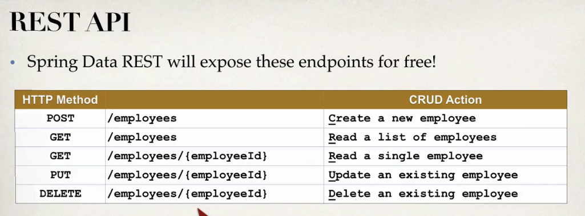
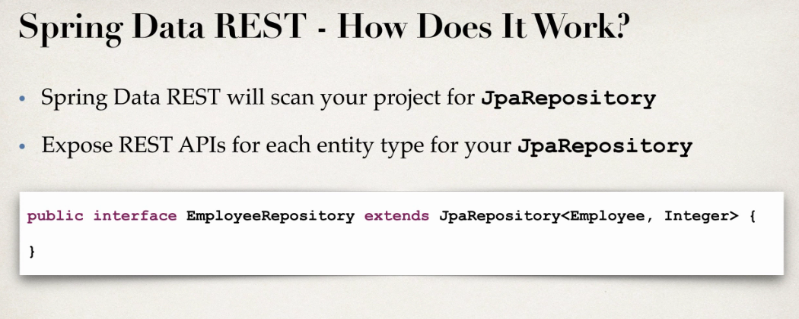
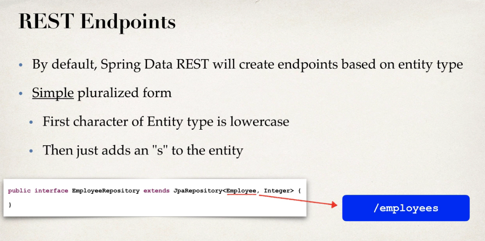
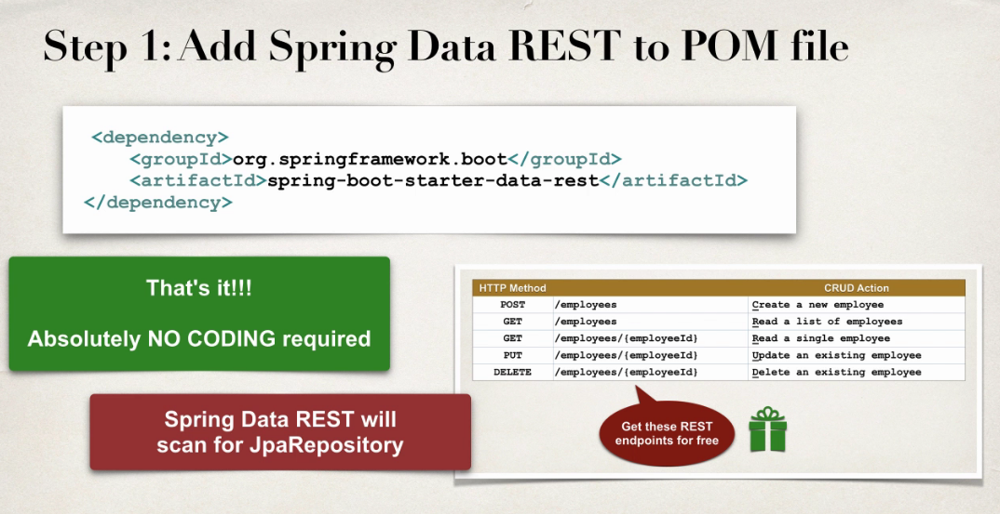
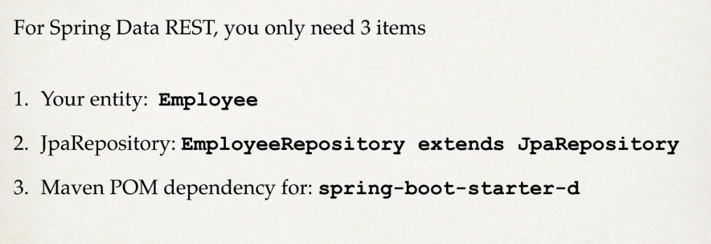

* HATEOAS - Hypermedia as the Engine of Application State: Spring Data Rest добавляет в ответе некую мета информацию о переданных данных (например размер страницы).


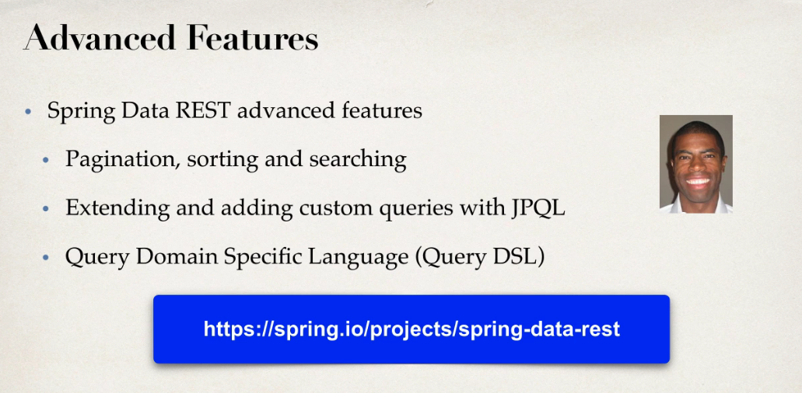
```properties
#
# Spring Data REST properties
#
spring.data.rest.base-path=/api
spring.data.rest.default-page-size=20
```


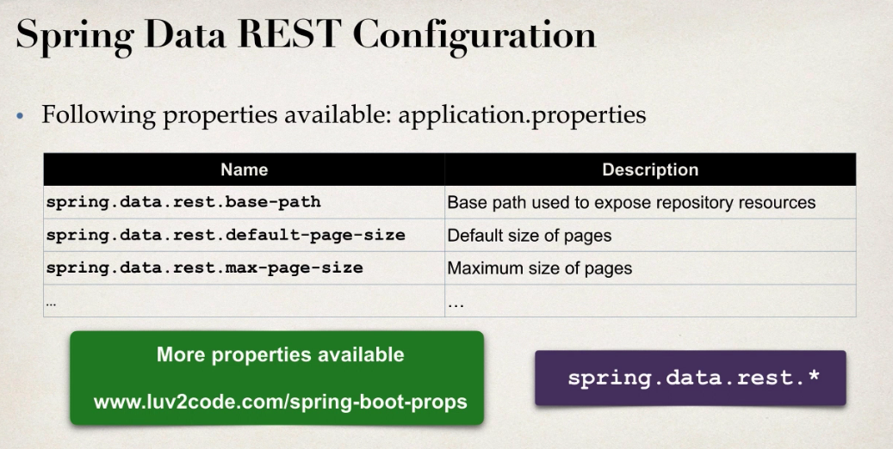

