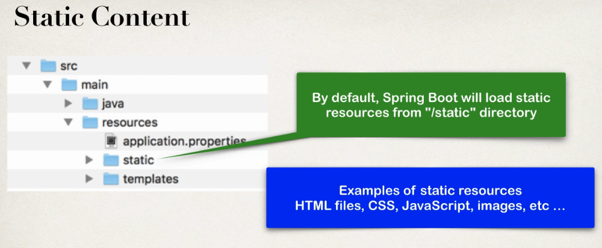
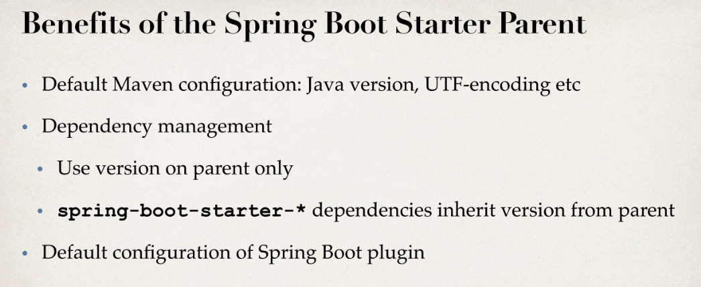

# SpringBoot
* см. SpringAndHibernate/spring-boot/mycoolapp/


* Используя <span style="color:blue;">SpringBoot</span> можно запускать приложение, используя втроенный <span style="color:blue;">http-server</span> или деплоить приложение на <span style="color:blue;">standalone server</span>.
* Поддержка SpringBoot включена в различные IDE ( в т.ч. в Netbeans).


* mycoolapp: Сгенерируем проект со встроенным tomcat-сервером и поддержкой spring mvc (см. SpringAndHibernate/spring-boot/mycoolapp/)
  1. goto start.spring.io
  2. GAV com.luv2code.springboot.demo,mycoolapp
  3. Сборщик: maven
  4. dependencies: web
* приложение деплоится на запускаемый сервер по корневому пути.
* запуск осуществляется простой командой:
```bash
java -jar mycoolapp.jar
```
* Добавим в приложение <b>@RestController</b> возвращающий строку по корневому пути(FunRestController).

## SpringBoot Project Structure
##### Структура каталогов:


* Если maven проинсталлирован локально, то mwnw файлы можно удалить.

##### pom.xml содержит:
  1. Ссылку на ParentPom.
  2. Указанные GAV-координаты проекта.
  3. Выбранные зависимости, которые содержат транзитивные зависимости с правильными версиями (т.н.spring boot starters):
  ```xml
  <dependencies>
		<dependency>
			<groupId>org.springframework.boot</groupId>
			<artifactId>spring-boot-starter-web</artifactId>
		</dependency>

		<dependency>
			<groupId>org.springframework.boot</groupId>
			<artifactId>spring-boot-starter-test</artifactId>
			<scope>test</scope>
		</dependency>
  </dependencies>
  ```

  4. <b>spring-boot-maven-plugin</b> содержащий разные задачи, например:
  ```bash
  mvn spring-boot:run
  ```

##### Исходный код:
  1. Приложение запускается при помощи <b>  SpringApplication.run(...)</b>
  этот класс создает ApplicationContext, запускает встроенный сервер Tomcat и совершает прочие действия, необходимые для запуска приложения.

  2. <b>MycoolappApplication</b> это собственно точка входа в приложение и одновременно класс конфигурации, аннотированный через <b>@SpringBootApplication</b>


  * <b>Application-класс</b> следует располагать в корневом пакете, чтобы все бины из подпакетов могли быть зарегистрированы.


  * Можно добавить нужные для сканирования пакеты и вручную:


  3. <b>application.properties</b> - файл свойств, автоматически загружамый SpringBoot. Может содержать предопределенные и произвольные свойства:
  ```propertes
  #pre-defined property
  server.port=8585
  #custom property
  coach.name=My Coach
  ```
  * Свойства из файла свойств инжектируются как обычно через <b>@Value("${prop.name}")</b>:


  4. <b>Статические ресурсы</b> - html,css etc. располагаются в директории <b>src/main/resources/static</b>.

  
  

  5. <b>Шаблоны</b>

  

  6. <b>Unit tests</b>

  

##### Spring boot starters
* Содержат наборы зависимостей с правильными версиями.


* Spring initializr автоматически добавит в проект выбранные spring-boot-starters.
* <b>Spring-boot-starter-parent</b>:
    1. Хранит настройки по умолчанию (кодировка,версия java,...) - можно переопределить в элементе <b>\<properties\></b>;
    2. Хранит версии <b>spring-boot-starter-* </b>
    3. Содержит конфигурацию <b>spring-boot-maven-plugin</b>



##### Spring boot dev tools


* В IDEA нужно построить проект заново(mvn package), чтобы изменения кода привели к рестарту контейнера.

##### Spring boot actuator
* Spring boot actuator позволяет проверять статус запушенного приложения,управлять им и собирать статистику.


```xml
<!-- add support for management,info etc -->
<dependency>
			<groupId>org.springframework.boot</groupId>
			<artifactId>spring-boot-starter-actuator</artifactId>
</dependency>
```
##### Running spring boot from CMD

* Запускать spring-boot приложения можно 2-мя способами:
```bash
#method 1
mvn[w] package
cd target
java -jar jarname.jar
#method2
mvn[w] package
mvn[w] spring-boot:run
```
